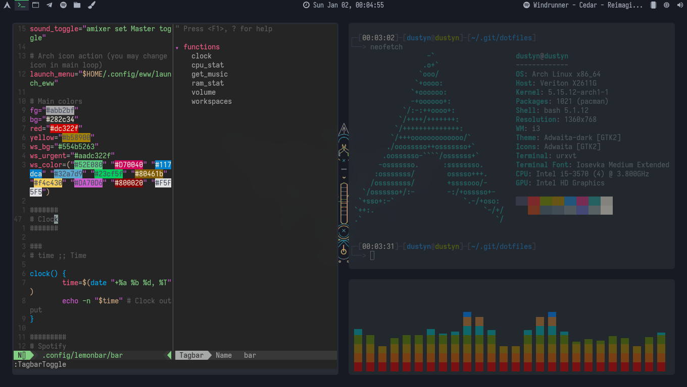
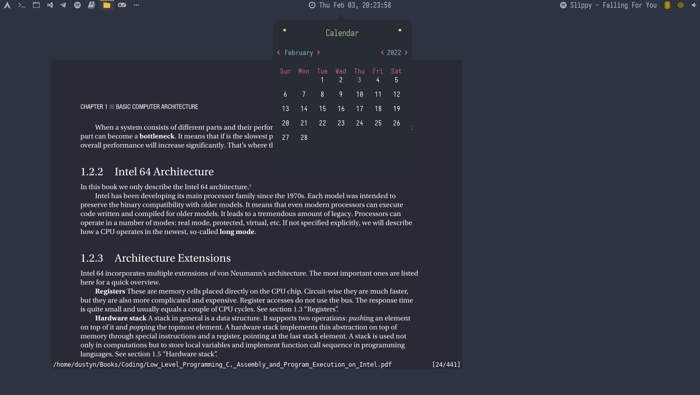
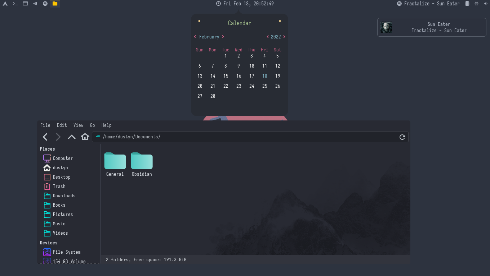
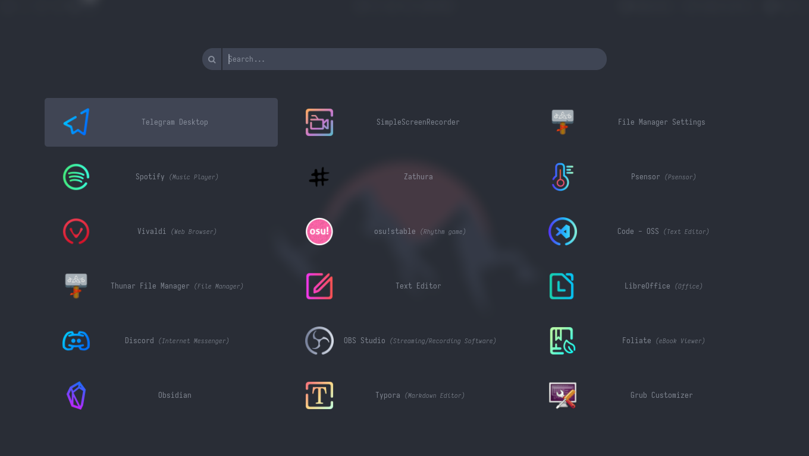
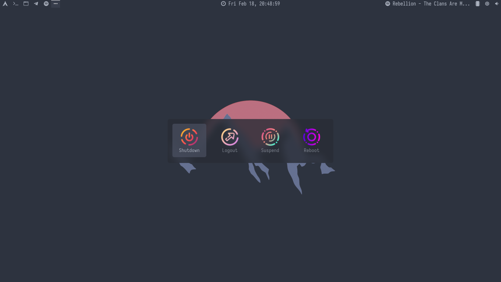

# dotfiles
> Linux config files (rxvt-unicode, kitty, flameshot, dunst, polybar, picom, cava, cmus, zathura, rofi, i3-gaps, nvim, ranger)
```text
                    dP            dP   .8888b oo dP
                    88            88   88   "    88
              .d888b88 .d8888b. d8888P 88aaa  dP 88 .d8888b. .d8888b.
              88'  `88 88'  `88   88   88     88 88 88ooood8 Y8ooooo.
              88.  .88 88.  .88   88   88     88 88 88.  ...       88
.------------ `88888P8 `88888P'   dP   dP     dP dP `88888P' `88888P' ------------.
|::::::::::::::.......::......::::..:::..:::::..:..::......:::......::::::::::::::|
|:::::::::::::::::::::::::::::::::::::::::::::::::::::::::::::::::::::::::::::::::|
|:::::::::::::::::::::::::::::::::::::::::::::::::::::::::::::::::::::::::::::::::|
|---------------------------------------------------------------------------------|
|         cmus | c* music player                                          cmus(1) |
|        dunst | notification daemon                                     dunst(1) |
|           i3 | window manager                                             i3(1) |
|        picom | a compositor for X11                                    picom(1) |
|    flameshot | powerful, simple-to-use screenshot software         flameshot(1) |
|      polybar | a fast and easy-to-use status bar                     polybar(1) |
|        kitty | the fast, feature-rich, GPU based terminal               kitty(1) |
|       neovim | text editor                                              nvim(1) |
| rxvt-unicode | a VT102 emulator for the X window system      urxvt(1), urxvt(7) |
|       ranger | file manager                                           ranger(1) |
|         rofi | run launcher, window switcher, etc.                      rofi(1) |
|          x11 | x window system                       x(7), xinit(1), xserver(1) |
`---------------------------------------------------------------------------------'
```

## Table of contents
* [General info](#general-info)
* [Screenshots](#screenshots)
* [Steps for the installation](#steps-for-the-installation)
* [Tips](#tips)
* [Hotkeys](#hotkeys)
* [ToDo List](#todo-list)
* [Afterwords](#afterwords)

# General info
This dotfiles include `.Xresources` files for urxvt and `.config` files, with some commented code. You may uncomment and test it.
Change keyboard layout in `.xinit` or delete it, if you use only one language.
Hopefully I can improve these configs, add something and remove the useless code, so stay tuned for more updates.
For additional info i suggest you to check Arch Wiki pages about this utils to set them correctly up.

# Screenshots


*terminal emulators and type test*\
\
\
\

*zathura*\
\
\
\

*dunst and thunar*\
\
\
\

*rofi app search*\
\
\
\

*rofi powermenu*

# Steps for the installation
1. **Script :**
```bash
./install.sh pacman aur set zsh
```
> Installs all pacman/AUR packages, moves configs to `~`, and sets up zsh. The script will use `yay` if it's already installed; otherwise it falls back to `paru` and offers to install it for you. If something goes wrong, there's an instruction below for manual installation.

2. **Utils list :**
    - WM : [i3-gaps](https://github.com/Airblader/i3)
	- Shell : zsh
		- [starship](https://github.com/starship/starship)
		- [zoxide](https://github.com/ajeetdsouza/zoxide)
		- [zsh-autosuggestion](https://github.com/zsh-users/zsh-autosuggestions)
		- [zsh-syntax-highlighting](https://github.com/zsh-users/zsh-syntax-highlighting)
		- [oh-my-zsh](https://github.com/ohmyzsh/ohmyzsh)
	- Fonts : [Iosevka](https://typeof.net/Iosevka/), [Hack Nerd Fonts](https://github.com/ryanoasis/nerd-fonts/tree/master/patched-fonts/Hack), [Fira Code](https://github.com/tonsky/FiraCode)
	- Locker : none bundled — set up a screen locker yourself (e.g. [i3lock](https://github.com/i3/i3lock), [i3lock-fancy](https://github.com/meskarune/i3lock-fancy), [betterlockscreen](https://github.com/betterlockscreen/betterlockscreen), or your own `xss-lock` hook)
    - Icons : [Candy Icons](https://github.com/EliverLara/candy-icons), [Papirus](https://github.com/PapirusDevelopmentTeam/papirus-icon-theme)
    - Music player : [cmus](https://github.com/cmus/cmus) ([some themes](https://github.com/averms/base16-cmus))
    - Audio visualizer : [cava](https://github.com/karlstav/cava)
	- Notification daemon : [dunst](https://github.com/dunst-project/dunst)
	- Cursor : Breeze
	- GTK Theme : [Qogir](https://github.com/vinceliuice/Qogir-theme)
	- Terminal emulator :
		- **Kitty** (default) — fast, GPU-accelerated, recommended unless your hardware is weak
		- URxvt <tmux> (lightweight alternative for weaker machines) :
			- [urxvt-perls](https://github.com/muennich/urxvt-perls)
			- [urxvt-font-size](https://github.com/majutsushi/urxvt-font-size)
			- [urxvt-tabbedex](https://github.com/stepb/urxvt-tabbedex)
	- File manager : 
		- Terminal : [ranger](https://github.com/ranger/ranger)
		- GUI : [thunar](https://github.com/xfce-mirror/thunar)
	- Screenshot software : [maim](https://github.com/naelstrof/maim), [flameshot](https://github.com/flameshot-org/flameshot)
    - Statusbar : [polybar](https://github.com/polybar/polybar)
    - Text editor : 
		- Terminal : [neovim](https://github.com/neovim/neovim) 
			- [Plugin manager](https://github.com/lazyvim/lazyvim)
			- Themes :
				- [Navarasu's onedark](https://github.com/navarasu/onedark.nvim)
				- [Joshdick's onedark](https://github.com/joshdick/onedark.vim)
				- [Crusoexia's monokai](https://github.com/crusoexia/vim-monokai)
		- GUI : [typora](https://typora.io), [xed](https://github.com/linuxmint/xed)
	- Compositor : [picom](https://github.com/yshui/picom)
    - App launcher : [rofi](https://github.com/davatorium/rofi)
    - Wallpapers : [lambda wallpapers](https://github.com/pagankeymaster/lambda-wallpapers), [Aenami](https://www.reddit.com/user/Aenami/)
	- Document viewer : [zathura](https://github.com/pwmt/zathura) ([Dracula theme](https://github.com/dracula/zathura))
	- Type Test : [tt](https://github.com/lemnos/tt)
	- Terminal decoration : [pipes.sh](https://github.com/pipeseroni/pipes.sh), [cmatrix](https://github.com/abishekvashok/cmatrix), [cbonsai](https://gitlab.com/jallbrit/cbonsai)
	- Markdown Knowledge Vault : [obsidian](https://obsidian.md)

## Required packages : 	
- AUR :
	- [Iosevka](https://aur.archlinux.org/ttf-iosevka/)
	- [Candy icons](https://aur.archlinux.org/packages/candy-icons-git)
	- [Breeze](https://aur.archlinux.org/packages/breeze-default-cursor-theme)
	- [Qogir](https://aur.archlinux.org/packages/qogir-gtk-theme)
- Pacman :
	- i3-gaps (may replace your current i3, won't occur any major changes except adding gaps)
	- cmus
	- maim
	- flameshot
	- neovim (ctags)
	- rofi
	- feh
	- xss-lock
	- rxvt-unicode
	- kitty
	- thunar
	- ranger (ueberzug)
	- zathura
	- dunst
	- papirus-icon-theme
	- picom
	- cava
	- polybar
	- ttf-iosevka-nerd
	- ttf-hack-nerd
	- ttf-fira-code
	- zsh
	- starship
	- zoxide
<br><br>
- For AUR :
	- `yay -S "package"` / `paru -S "package"` or `git clone "AUR_git_link"; cd "AUR_package"; makepkg -si`
- For Pacman :
	- `pacman -S "package"`

2. **Adding configs :**
	- Clone this repository. `https://github.com/CodeHeister/dotfiles`
	- If there's still no `.config` or other directories in your home directory (`~`), you may move all directories to your `~`. Otherwise just copy or include files of your interest. Respect file disposition to save configs from path error or replace all paths with your.
	- If everything is correctly installed and configs are added, all may work without troubles.

# Tips

- Add your keyboard layouts to `.xinitrc`.
- You can easily configure polybar output in `.config/polybar` and add your own modules. There's also an array of colors per workspace, so change workspace names accordingly.
- If you want to move rofi configs, don't forget to move colors.rasi with them in the same directory. Overwise you'll get default colors.
- A screen locker is not bundled anymore — wire up `xss-lock` (already installed) with a locker of your choice in `.xinitrc` or your i3 config.

# Hotkeys

<details>
<summary>i3-gaps</summary>

- `.config/i3/config` :
	- `Mod+[0-9]` : go to workspace
	- `Mod+Shift+[0-9]` : move active window to workspace
	- `Alt+Ctrl+[A/D]` : move to the left/right workspace
	- `Mod+Tab` : swap between current and last used workspace
	- `Mod+Shift+C` : reload i3 config file
	- `Mod+[Left/Right/Up/Down]` : change focus
	- `Mod+Shift+[Left/Right/Up/Down]` : move focused window (floating), swap windows (tilling)
	- `Mod+H` : split in horizontal orientation
	- `Mod+V` : split in vertical orientation
	- `Mod+F` : fullscreen toggle
	- `Mod+E` : layout reverse (toggle split)
	- `Mod+W` : layout tabbed
	- `Mod+S` : layout stacking
	- `Mod+D` : focus child
	- `Mod+A` : focus parent
	- `Mod+Shift+Space` : toggle tiling/floating for current window
	- `Mod+Space` : change focus between tiling/floating windows
	- `Mod+Shift+R` : restart i3
	- `Mod+R` : resize mode
		- `[Left/Right/Up/Down]` : resize
		- `Esc` : exit resize mode (don't forget to press it)
	- `Mod+Shift+P` : reload polybar
	- `Print` : fullscreen screenshot (saves to ~/Pictures/Screenshots)
	- `Ctrl+Print` : area or app screenshot (saves to ~/Pictures/Screenshots)
	- `Ctrl+Shift+Print` : flameshot (interactive screen software with utils)
	- `Mod+F3` : app searcher
	- `Alt+Tab` : active apps searcher 
	- `Mod+Shift+E` : powermenu
	- `Mod+F6` : prev Spotify song
	- `Mod+F7` : pause/resume Spotify song
	- `Mod+F8` : next Spotify song
	- `Mod+F9` : mute/unmute
	- `Mod+F10` : volume down
	- `Mod+F11` : volume up
	- `Mod+Shift+G` : change gaps
		- `O` : outer gaps
			- `+` : +5 to current value of the current workspace
			- `-` : -5 to current value of the current workspace
			- `0` : set gaps 0
			- `Shift++` : +5 to current value for all workspaces
			- `Shift+-` : -5 to current value for all workspaces
			- `Shift+0` : set all gaps 0
			- `Esc` : exit gaps editor
		- `I` : inner gaps
			- `+` : +5 to current value of the current workspace
			- `-` : -5 to current value of the current workspace
			- `0` : set gaps 0
			- `Shift++` : +5 to current value for all workspaces
			- `Shift+-` : -5 to current value for all workspaces
			- `Shift+0` : set all gaps 0
			- `Esc` : exit gaps editor
	- `Mod+Shift+T` or `Mod+Enter` : launch terminal (kitty, or urxvt if configured)
	- `Mod+Q` : hide current window
	- `Mod+Z` : roll through hidden windows
	- `Mod+Shift+Q` : close current window
	- `Mod+DragMouseLeftButton` : drag floating windows
	- `Mod+DragMouseRightButton` : resize non-floating windows and gaps between them
</details>

<br><br>

<details>
<summary>X11</summary>

- `.xinitrc` :
	- `Alt+Tab` : change keyboard layout (disabled) uncomment `setxkbmap` and add your layouts)
</details>

<br><br>

<details>
<summary>URxvt (optional, lightweight terminal for weaker hardware)</summary>

- `.Xresources.d/urxvt-unicode` :
	- `Tab` : autofill
	- `Shift+Tab` : autofill (backwards)
	- `Ctrl+Shift+C` : copy
	- `Ctrl+Shift+V` : paste
	- `Ctrl+Up` : increase font size
	- `Ctrl+Down` : decrease font size
	- `Ctrl+Shift+Up` : increase font size (global)
	- `Ctrl+Shift+Down` : decrease font size (global)
	- `Ctrl+=` : reset font size
	- `Ctrl+/` : show font size
	- `Ctrl+Tab` : select urls
	- `Ctrl+s` : search in terminal
	- `Ctrl+Esc` : activate selection mode
		- `[h/j/k/l]` : Move cursor left/down/up/right (also with arrow keys)
		- `[g/G/0/^/$/H/M/L/f/F/;/,/w/W/b/B/e/E]` : More vi-like cursor movement keys
		- `['/'/?]` : Start forward/backward search
		- `[n/N]`: Repeat last search, N: in reverse direction
		- `Ctrl+[f/b]` : Scroll down/up one screen
		- `Ctrl+[d/u]` : Scroll down/up half a screen
		- `[v/V/Ctrl+v]` : Toggle normal/linewise/blockwise selection
		- `[y/Return]` : Copy selection to primary buffer, Return: quit afterwards
		- `Y` : Copy selected lines to primary buffer or cursor line and quit
		- `[q/Escape]` : Quit keyboard selection mode
	- `Shift+Down` : open new tab
	- `Ctrl+d` : close tab
	- `Shift+Up` : rename
	- `Ctrl+[Left/Right]` : move tabs (left/right)
	- `Shift+[Left/Right]` : go to tab (left/right)
</details>

<details>
<summary>Kitty</summary>

**Theme**
- Onedark-style scheme: dark background (`#282c34`), warm foreground (`#839496`)
- 16-color palette tuned for an Onedark/Solarized-ish hybrid look

**Tabs**
- Powerline-style tab bar (slanted), pinned to the top
- Active tab highlighted (`#979eab` bg / dark fg), inactive tabs blend into the background
- Tab titles show `index:title`; active tab shows just the title

**Fonts**
- Iosevka Light (12.5pt), with Bold / Italic / Bold Italic variants
- Ligatures enabled by default, with hotkeys to toggle scope

**Hotkeys**
- `Ctrl+Shift+Down` : new tab
- `Ctrl+Shift+D` : close tab
- `Ctrl+Shift+Up` : rename tab
- `Ctrl+[1-9]` : jump to tab 1–9
- `Ctrl+0` : jump to tab 10
- `Alt+1` : disable ligatures in active tab, always
- `Alt+2` : enable ligatures everywhere, never disable
- `Alt+3` : disable ligatures in tab under cursor
- `Ctrl+Shift+C` / `Ctrl+Shift+V` : copy / paste clipboard

**Misc**
- URL detection on, curly underline style, opens with system default handler
- Copy-on-select off, audio bell off

</details>

# ToDo List

- [x] Onedark Thunar
- [x] Switch statusbar from lemonbar to polybar
- [x] Switch default terminal to kitty
- [x] Add startpage
- [x] Better urxvt

# Afterwords

I'm looking forward for your tips and i'm ready to help you or add some info here, if you'll consider it necessary. I'll necessary clear and improve configs to make it more flexible and convenient.
