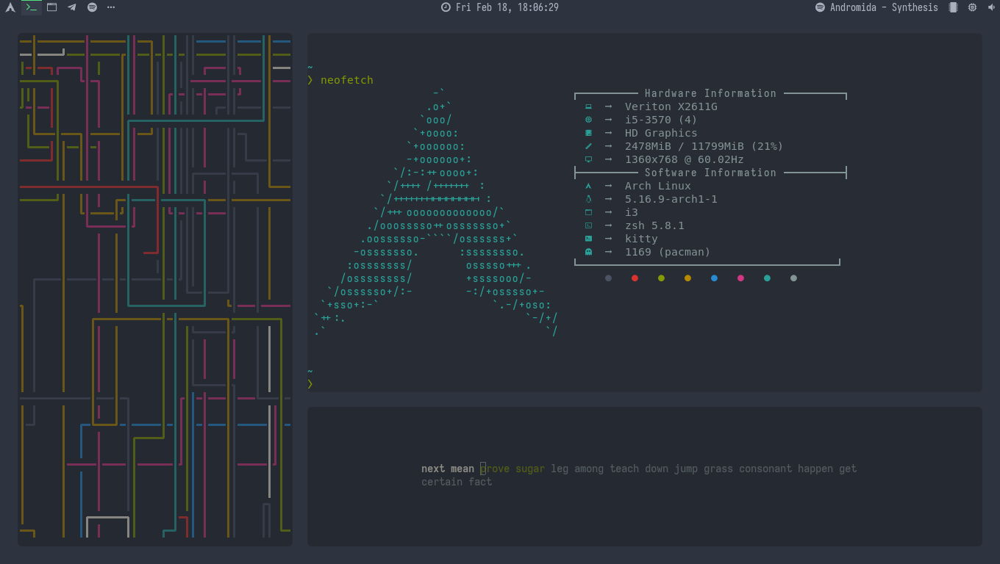
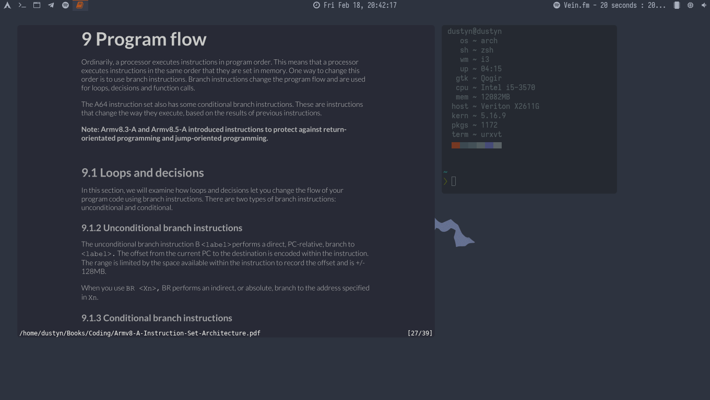

# dotfiles
> Linux config files (rxvt-unicode, flameshot, dunst, lemonbar-xft, picom, cava, cmus, eww, zathura, rofi, i3-gaps, nvim, ranger)
```text
                    dP            dP   .8888b oo dP
                    88            88   88   "    88
              .d888b88 .d8888b. d8888P 88aaa  dP 88 .d8888b. .d8888b.
              88'  `88 88'  `88   88   88     88 88 88ooood8 Y8ooooo.
              88.  .88 88.  .88   88   88     88 88 88.  ...       88
.------------ `88888P8 `88888P'   dP   dP     dP dP `88888P' `88888P' ------------.
|::::::::::::::.......::......::::..:::..:::::..:..::......:::......::::::::::::::|
|:::::::::::::::::::::::::::::::::::::::::::::::::::::::::::::::::::::::::::::::::|
|:::::::::::::::::::::::::::::::::::::::::::::::::::::::::::::::::::::::::::::::::|
|---------------------------------------------------------------------------------|
|         cmus | c* music player                                          cmus(1) |
|        dunst | notification daemon                                     dunst(1) |
|           i3 | window manager                                             i3(1) |
|        picom | a compositor for X11                                    picom(1) |
|    flameshot | powerful, simple-to-use screenshot software         flameshot(1) |
|     lemonbar | featherweight lemon-scented bar                      lemonbar(1) |
|          eww | simple widgets                                                   |
|       neovim | text editor                                              nvim(1) |
| rxvt-unicode | a VT102 emulator for the X window system      urxvt(1), urxvt(7) |
|       ranger | file manager                                           ranger(1) |
|         rofi | run launcher, window switcher, etc.                      rofi(1) |
|          x11 | x window system                       x(7), xinit(1), xserver(1) |
`---------------------------------------------------------------------------------'
```

## Table of contents :
* [General info](#general-info)
* [Screenshots](#screenshots)
* [Steps for the installation](#installation)
* [Tips](#tips)
* [Hotkeys](#hotkeys)
* [ToDo List](#todo-list)
* [Afterwords](#afterwords)

# General info
This dotfiles include `.Xresources` files for urxvt and `.config` files, with some commented code. You may uncomment and test it.
Change keyboard layout in `.xinit` or delete it, if you use only one language.
Hopefully I can improve these configs, add something and remove the useless code, so stay tuned for more updates.
For additional info i suggest you to check Arch Wiki pages about this utils to set them correctly up.

# Screenshots


*eww widgets*\
\
\
\

*parallax startpage*\
\
\
\

*terminal emulator and type test*\
\
\
\

*zathura*\
\
\
\

*obsidian markdown vaults*\
\
\
\

*xed, foliate and thunar*\
\
\
\

*rofi app search*\
\
\
\

*rofi powermenu*

# Steps for the installation

1. **Utils list :**
    - WM : [i3-gaps](https://github.com/Airblader/i3)
	- Shell : zsh (ohmyzsh + starship)
    - Fonts : [Iosevka](https://typeof.net/Iosevka/), [Hack Nerd Fonts](https://github.com/ryanoasis/nerd-fonts/tree/master/patched-fonts/Hack)
    - Icons : [Candy Icons](https://github.com/EliverLara/candy-icons), [Papirus](https://github.com/PapirusDevelopmentTeam/papirus-icon-theme)
    - Music player : [cmus](https://github.com/cmus/cmus) ([some themes](https://github.com/averms/base16-cmus))
    - Audio visualizer : [cava](https://github.com/karlstav/cava)
	- Notification daemon : [dunst](https://github.com/dunst-project/dunst)
	- Cursor : Breeze
	- Terminal emulator : urxvt (urxvt-perl) <tmux>, kitty
	- File manager : 
		- GUI : thunar
		- Terminal : [ranger](https://github.com/ranger/ranger)
	- Screenshot software : [maim](https://github.com/naelstrof/maim), [flameshot](https://github.com/flameshot-org/flameshot)
    - Widgets : [eww](https://github.com/elkowar/eww) ([docs](https://elkowar.github.io/eww/)) 
        - 1920x1080 : [adi1090x's widgets](https://github.com/adi1090x/widgets)
        - 1360x768 : [edited widgets](.config/eww) with Spotify
    - Statusbar : [lemonbar-xft](https://github.com/drscream/lemonbar-xft)
    - Text editor : 
		- Terminal : [neovim](https://github.com/neovim/neovim) ([Plugin manager](https://github.com/junegunn/vim-plug)), ([Navarasu's onedark](https://github.com/navarasu/onedark.nvim), [Joshdick's onedark](https://github.com/joshdick/onedark.vim), [Crusoexia's monokai](https://github.com/crusoexia/vim-monokai))
		- GUI : [xed](https://github.com/linuxmint/xed)
	- Compositor : [Ibhagwan's picom](https://github.com/ibhagwan/picom-ibhagwan-git)
    - App launcher : [rofi](https://github.com/davatorium/rofi)
    - Wallpapers : [lambda wallpapers](https://github.com/pagankeymaster/lambda-wallpapers), [Aenami](https://www.reddit.com/user/Aenami/)
	- Document viewer : [zathura](https://github.com/pwmt/zathura) ([Dracula theme](https://github.com/dracula/zathura))
	- Type Test : [tt](https://github.com/lemnos/tt)
	- Terminal decoration : [pipes.sh](https://github.com/pipeseroni/pipes.sh), [cmatrix](https://github.com/abishekvashok/cmatrix), [cbonsai](https://gitlab.com/jallbrit/cbonsai)
	- Markdown Knowledge Vault : [obsidian](https://obsidian.md)

	- AUR :
		- [Iosevka](https://aur.archlinux.org/ttf-iosevka/)
		- [Hack Nerd Fonts](https://aur.archlinux.org/nerd-fonts-hack/)
		- [lemonbar-xft](https://aur.archlinux.org/lemonbar-xft-git/)
		- [eww](https://aur.archlinux.org/packages/eww-git/)
		- [cava](https://aur.archlinux.org/packages/cava/)
		- [picom](https://aur.archlinux.org/packages/picom-ibhagwan-git/)
		- [Papirus](https://archlinux.org/packages/community/any/papirus-icon-theme/)
	- Pacman :
		- i3-gaps (may replace your current i3, won't occur any major changes except adding gaps)
		- cmus
		- maim
		- flameshot
		- neovim (ctags)
		- rofi
		- urxvt
		- thunar
		- ranger (ueberzug)
		- zathura
		- dunst

	- For AUR :
		- `yay -S "package"` or `git clone "AUR_git_link"; cd "AUR_package"; makepkg -si`
	- For Pacman :
		- `pacman -S "package"`

2. **Adding configs :**
	- Clone this repository. `https://github.com/CodeHeister/dotfiles`
	- If there's still no `.config` or other directories in your home directory (`~`), you may move all directories to your `~`. Otherwise just copy or include files of your interest. Respect file disposition to save configs from path error or replace all paths with your.
	- If everything is correctly installed and configs are added, all may work without troubles.

# Tips

- Don't forget to add your API keys to `.config/eww/scripts`.
- Add your keyboard layouts to `.xinitrc`.
- You can easily configure lemonbar output in `.config/lemonbar/bar` and add your own functionality. There's also an array of colors. Each color is binded to workspace number, so change workspace's names correctly.
- If you want to move rofi configs, don't forget to move colors.rasi with them in the same directory. Overwise you'll get default colors.

# Hotkeys

- i3-gaps (`.config/i3/config`) :
	- `Mod+[0-9]` : go to workspace
	- `Mod+Shift+[0-9]` : move active window to workspace
	- `Alt+Ctrl+[A/D]` : move to the left/right workspace
	- `Mod+Tab` : swap between current and last used workspace
	- `Mod+Shift+C` : reload i3 config file
	- `Mod+[Left/Right/Up/Down]` : change focus
	- `Mod+Shift+[Left/Right/Up/Down]` : move focused window
	- `Mod+H` : split in horizontal orientation
	- `Mod+V` : split in vertical orientation
	- `Mod+F` : fullscreen toggle
	- `Mod+E` : layout reverse (toggle split)
	- `Mod+W` : layout tabbed
	- `Mod+S` : layout stacking
	- `Mod+D` : focus child
	- `Mod+A` : focus parent
	- `Mod+Shift+Space` : toggle tiling/floating for current window
	- `Mod+Space` : change focus between tiling/floating windows
	- `Mod+Shift+R` : restart i3
	- `Mod+R` : resize mode
		- `[Left/Right/Up/Down]` : resize
		- `Esc` : exit resize mode (don't forget to press it)
	- `Mod+Shift+A` : start lemonbar
	- `Mod+Shift+D` : close lemonbar
	- `Print` : fullscreen screenshot (saves to ~/Pictures/Screenshots)
	- `Ctrl+Print` : area or app screenshot (saves to ~/Pictures/Screenshots)
	- `Ctrl+Shift+Print` : flameshot (interactive screen software with utils)
	- `Mod+F3` : app searcher
	- `Alt+Tab` : active apps searcher 
	- `Mod+Shift+E` : powermenu
	- `Mod+F9` : mute/unmute
	- `Mod+F10` : volume down
	- `Mod+F11` : volume up
	- `Mod+Shift+G` : change gaps
		- `O` : outer gaps
			- `+` : +5 to current value of the current workspace
			- `-` : -5 to current value of the current workspace
			- `0` : set gaps 0
			- `Shift++` : +5 to current value for all workspaces
			- `Shift+-` : -5 to current value for all workspaces
			- `Shift+0` : set all gaps 0
			- `Esc` : exit gaps editor
		- `I` : inner gaps
			- `+` : +5 to current value of the current workspace
			- `-` : -5 to current value of the current workspace
			- `0` : set gaps 0
			- `Shift++` : +5 to current value for all workspaces
			- `Shift+-` : -5 to current value for all workspaces
			- `Shift+0` : set all gaps 0
			- `Esc` : exit gaps editor
	- `Mod+Shift+T` or `Mod+Enter` : launch terminal
	- `Mod+Shift+Q` : close current app
	- `Mod+F1` : launch/exit eww
	- `Mod+DragMouseLeftButton` : drag floating windows
	- `Mod+DragMouseRightButton` : resize non-floating windows and gaps between them
<br><br>
- X11 (`.xinitrc`) :
	- `Alt+Tab` : change keyboard layout (disabled) uncomment `setxkbmap` and add your layouts)
<br><br>
- URxvt (`.Xresources.d/urxvt-unicode`):
	- `Tab` : autofill
	- `Shift+Tab` : autofill (backwards)
	- `Ctrl+Shift+C` : copy
	- `Ctrl+Shift+V` : paste
	- `Ctrl+Up` : increase font size
	- `Ctrl+Down` : decrease font size
	- `Ctrl+Shift+Up` : increase font size (global)
	- `Ctrl+Shift+Down` : decrease font size (global)
	- `Ctrl+=` : reset font size
	- `Ctrl+/` : show font size
	- `Ctrl+u` : select urls
	- `Ctrl+s` : search in terminal
	- `Ctrl+Esc` : activate selection mode
		- `[h/j/k/l]` : Move cursor left/down/up/right (also with arrow keys)
		- `[g/G/0/^/$/H/M/L/f/F/;/,/w/W/b/B/e/E]` : More vi-like cursor movement keys
		- `['/'/?]` : Start forward/backward search
		- `[n/N]`: Repeat last search, N: in reverse direction
		- `Ctrl+[f/b]` : Scroll down/up one screen
		- `Ctrl+[d/u]` : Scroll down/up half a screen
		- `[v/V/Ctrl+v]` : Toggle normal/linewise/blockwise selection
		- `[y/Return]` : Copy selection to primary buffer, Return: quit afterwards
		- `Y` : Copy selected lines to primary buffer or cursor line and quit
		- `[q/Escape]` : Quit keyboard selection mode
	- `Shift+Down` : open new tab
	- `Ctrl+d` : close tab
	- `Shift+Up` : rename
	- `Ctrl+[Left/Right]` : move tabs (left/right)
	- `Shift+[Left/Right]` : go to tab (left/right)
	
# ToDo List

- [x] Onedark Thunar
- [x] Change eww widgets
- [x] Add startpage
- [x] Better urxvt

# Afterwords

I'm looking forward for your tips and i'm ready to help you or add some info here, if you'll consider it necessary. I'll necessary clear and improve configs to make it more flexible and convenient. 
