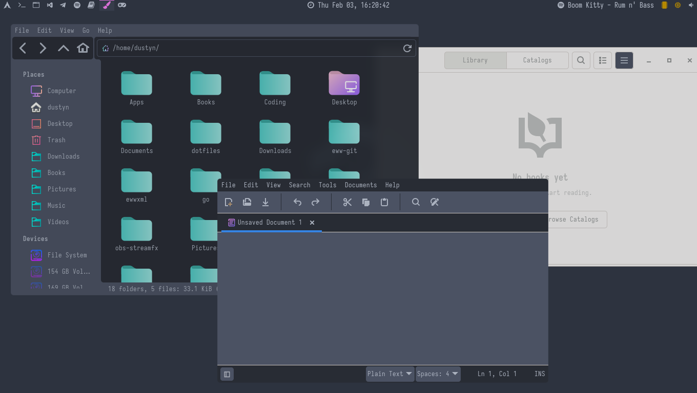
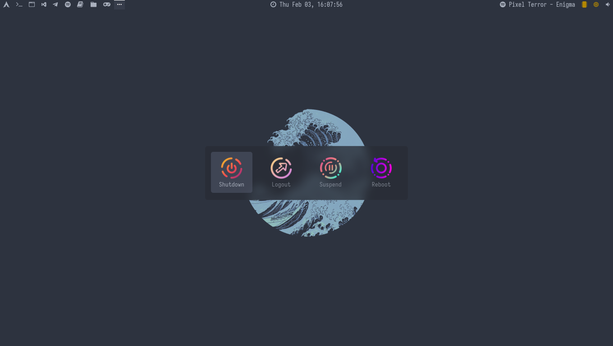

# dotfiles
> Linux config files (rxvt-unicode, flameshot, dunst, lemonbar-xft, picom, cava, cmus, eww, zathura, rofi, i3-gaps, nvim, ranger)
```text
                    dP            dP   .8888b oo dP
                    88            88   88   "    88
              .d888b88 .d8888b. d8888P 88aaa  dP 88 .d8888b. .d8888b.
              88'  `88 88'  `88   88   88     88 88 88ooood8 Y8ooooo.
              88.  .88 88.  .88   88   88     88 88 88.  ...       88
.------------ `88888P8 `88888P'   dP   dP     dP dP `88888P' `88888P' ------------.
|::::::::::::::.......::......::::..:::..:::::..:..::......:::......::::::::::::::|
|:::::::::::::::::::::::::::::::::::::::::::::::::::::::::::::::::::::::::::::::::|
|:::::::::::::::::::::::::::::::::::::::::::::::::::::::::::::::::::::::::::::::::|
|---------------------------------------------------------------------------------|
|         cmus | c* music player                                          cmus(1) |
|        dunst | notification daemon                                     dunst(1) |
|           i3 | window manager                                             i3(1) |
|        picom | a compositor for X11                                    picom(1) |
|    flameshot | powerful, simple-to-use screenshot software         flameshot(1) |
|     lemonbar | featherweight lemon-scented bar                      lemonbar(1) |
|          eww | simple widgets                                                   |
|       neovim | text editor                                              nvim(1) |
| rxvt-unicode | a VT102 emulator for the X window system      urxvt(1), urxvt(7) |
|       ranger | file manager                                           ranger(1) |
|         rofi | run launcher, window switcher, etc.                      rofi(1) |
|          x11 | x window system                       x(7), xinit(1), xserver(1) |
`---------------------------------------------------------------------------------'
```

## Table of contents
* [General info](#general-info)
* [Screenshots](#screenshots)
* [Installation](#installation)
* [ToDo List](#todo-list)
* [Afterwords](#afterwords)

# General info
This dotfiles include `.Xresources` files for urxvt and `.config` files, with some commented code. You may uncomment and test it.
Change keyboard layout in `.xinit` or delete it, if you use only one language.
Hopefully I can improve these configs, add something and remove the useless code, so stay tuned for more updates.
For additional info i suggest you to check Arch Wiki pages about this utils to set them correctly up.

# Screenshots


*eww widgets*\
\
\
\

*terminal emulator*\
\
\
\

*zathura*\
\
\
\

*ranger and thunar*\
\
\
\

*rofi app search*\
\
\
\

*rofi powermenu*

# Installation

1. **Utils list:**
    - WM : [i3-gaps](https://github.com/Airblader/i3)
    - Fonts : [Iosevka](https://typeof.net/Iosevka/), [Hack Nerd Fonts](https://github.com/ryanoasis/nerd-fonts/tree/master/patched-fonts/Hack)
    - Icons : [Papirus](https://github.com/PapirusDevelopmentTeam/papirus-icon-theme)
    - Music player : [cmus](https://github.com/cmus/cmus) ([some themes](https://github.com/averms/base16-cmus))
    - Audio visualizer : [cava](https://github.com/karlstav/cava)
	- Notification daemon : [dunst](https://github.com/dunst-project/dunst)
	- Terminal emulator : urxvt
	- File manager : 
		- GUI : thunar
		- Terminal : [ranger](https://github.com/ranger/ranger)
	- Screenshot software : [maim](https://github.com/naelstrof/maim), [flameshot](https://github.com/flameshot-org/flameshot)
    - Widgets : [eww](https://github.com/elkowar/eww) ([docs](https://elkowar.github.io/eww/)) 
        - 1920x1080 : [adi1090x's widgets](https://github.com/adi1090x/widgets)
        - 1360x768 : [edited widgets](.config/eww) with Spotify
    - Statusbar : [lemonbar-xft](https://github.com/drscream/lemonbar-xft)
    - Text editor : [neovim](https://github.com/neovim/neovim) ([Plugin manager](https://github.com/junegunn/vim-plug)), ([Navarasu's onedark](https://github.com/navarasu/onedark.nvim), [Joshdick's onedark](https://github.com/joshdick/onedark.vim), [Crusoexia's monokai](https://github.com/crusoexia/vim-monokai))
    - Compositor : [Ibhagwan's picom](https://github.com/ibhagwan/picom-ibhagwan-git)
    - App launcher : [rofi](https://github.com/davatorium/rofi)
    - Wallpapers : [lambda wallpapers](https://github.com/pagankeymaster/lambda-wallpapers), [Aenami](https://www.reddit.com/user/Aenami/)
	- Document viewer : [zathura](https://github.com/pwmt/zathura) ([Dracula theme](https://github.com/dracula/zathura))
	- Terminal decoration : [pipes.sh](https://github.com/pipeseroni/pipes.sh), [cmatrix](https://github.com/abishekvashok/cmatrix), [cbonsai](https://gitlab.com/jallbrit/cbonsai) 

	Everything is described for Arch Linux.
	- AUR:
		- [Iosevka](https://aur.archlinux.org/ttf-iosevka/)
		- [Hack Nerd Fonts](https://aur.archlinux.org/nerd-fonts-hack/)
		- [lemonbar-xft](https://aur.archlinux.org/lemonbar-xft-git/)
		- [eww](https://aur.archlinux.org/packages/eww-git/)
		- [cava](https://aur.archlinux.org/packages/cava/)
		- [picom](https://aur.archlinux.org/packages/picom-ibhagwan-git/)
		- [Papirus](https://archlinux.org/packages/community/any/papirus-icon-theme/)
	- Pacman:
		- i3-gaps (may replace your current i3, won't occur any major changes except adding gaps)
		- cmus
		- maim
		- flameshot
		- neovim (ctags)
		- rofi
		- urxvt
		- thunar
		- ranger (w3m)
		- zathura
		- dunst

	- For AUR:
		- `yay -S "package"` or `git clone "AUR_git_link"; cd "AUR_package"; makepkg -si`
	- For Pacman:
		- `pacman -S "package"`

2. **Adding configs:**
	- Clone this repository. `https://github.com/CodeHeister/dotfiles`
	- If there's still no `.config` or other directories in your home directory (`~`), you may move all directories to your `~`. Otherwise just copy or include files of your interest. Respect file disposition to save configs from path error or replace all paths with your.
	- If everything is correctly installed and configs are added, all may work without troubles.

# ToDo List

- [ ] Add startpage
- [ ] Add colorscheme toggle

# Afterwords

I'm looking forward for your tips and i'm ready to help you or add some info here, if you'll consider it necessary. I'll necessary clear and improve configs to make it more flexible and convenient. 
